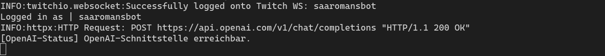
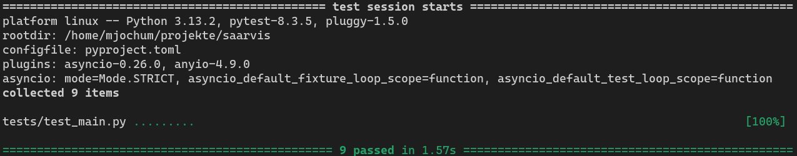

# saarvis – Twitch-Chatbot mit OpenAI- und ElevenLabs-TTS

## Projektbeschreibung

saarvis ist ein moderner Twitch-Chatbot auf Python-Basis, der OpenAI für KI-Antworten und ElevenLabs für Sprachausgabe nutzt. Die Konfiguration erfolgt über eine .env-Datei.

## Features

- Begrüßung neuer Nutzer im Twitch-Chat
- KI-gestützte Antworten auf Nachrichten mit @Nicole
- Sprachausgabe der Antworten via ElevenLabs (TTS)
- Flexible Konfiguration von Voice und Modell über Umgebungsvariablen
- Zuverlässige Audiowiedergabe via mpg123/mpv
- Einfache Anpassung des OpenAI-Modells und API-Keys über .env
- Statusprüfung der OpenAI-Schnittstelle beim Start

## Installation

Für die Installation verwende ich das Tool [uv](https://docs.astral.sh/uv/) und nicht wie vieleicht erwartet pip. 
Dadurch wird die Installation einfacher und auch viel schneller.

1. **Repository klonen**

   ```bash
   git clone https://github.com/mjochum64/saarvis
   cd saarvis
   ```

2. **.env-Datei anlegen** (Beispiel):

   ```env
   TMI_TOKEN=<dein_twitch_token>
   TWITCH_CHANNEL=<dein_channel>
   OPENAI_API_KEY=<dein_openai_key>
   OPENAI_MODEL=gpt-3.5-turbo
   ELEVENLABS_API_KEY=<dein_elevenlabs_key>
   ELEVENLABS_VOICE_ID=<deine_voice_id>
   ELEVENLABS_MODEL_ID=eleven_multilingual_v2
   ```

## Nutzung

Starte den Bot mit:

```bash
uv run main.py
```



Beim ersten Start werden alle benötigten Module installiert.

## Systemvoraussetzungen

- Python 3.13 
- uv 
- mpg123 oder mpv für die Audiowiedergabe
- ElevenLabs-Account für TTS

## Tests

Tests befinden sich im Verzeichnis `tests/` und können wie folgt gestartet werden:

```bash
uv run pytest tests/test_main.py
```




## Lizenz

Dieses Projekt steht unter der MIT-Lizenz. Siehe [LICENSE](LICENSE) für Details.

## Autor
Martin Jochum <mjochum64@gmail.com>

---
*Erstellt am 16.04.2025*
